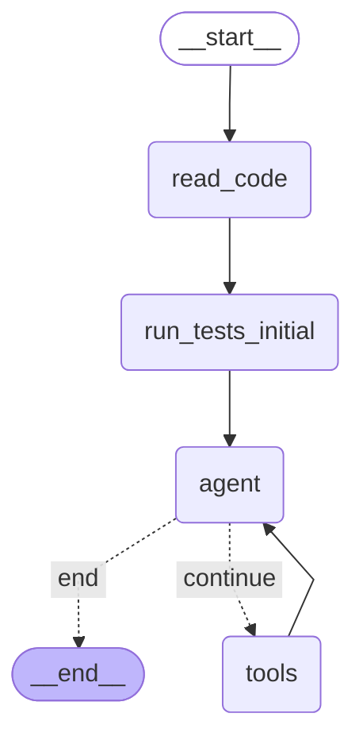

# Python Bug-Fixing LLM Agent

A local LLM-based agent that fixes buggy Python code using a **ReAct-style workflow** with LangGraph. The agent is evaluated on the **HumanEvalFix (Python)** benchmark using the **pass@1** metric.

# Features

- ReAct-style workflow
- LangGraph
- HumanEvalFix dataset (Python)
- Local model
- Tools: read_file, write_file, run_tests

# Usage

Create environment:
```bash
python3 -m venv .venv
source .venv/bin/activate  
```

Upload requirements.txt:
```bash
pip install --upgrade pip
pip install -r requirements.txt
```

Load model (prefer `qwen2.5:14b`):
```bash
ollama pull <model-name>
```

Run agent using HumanEvalFix datasets:
```bash
python run.py
```

# Flow


# Datasets 
- Large: full HumanEvalFix dataset (164 examples)
- Tiny: one example per each error type from HumanEalFix (6 examples)

# Evaluation
pass@1 metric 
Run generated code with predefined tests and check if it passes all tests or some error occurred.

# Experiments
I tried different local models from Qwen on Ollama.

Inference time is big (I run on M4 GPU):

Qwen3:
```
qwen3:4b: avg 127s per llm call
qwen3:8b: avg 102s per llm call
```

Qwen2.5:
```
qwen2.5:7b-instruct: avg 4s per llm call
qwen2.5:14b: avg 42s per llm call
```

Why such a difference? Less corpus size, but more time.
- Thinking mode – Qwen3 performs internal reasoning before output, making it slower. 
- 262K tokens context in Qwen3, 32K tokens in Qwen2.5. Ollama allocates KV-cache for the full window even if you use only a few thousand tokens → heavy memory load.

Due to high inference time large dataset is not suitable for iterative improvements, so try on tiny.

Evaluation on tiny dataset.
Versions:
- v1
  - model: `qwen2.5:14b`
  - ✓ Tests passed: 3 (50.0%)
  - ✗ Tests failed: 1 (16.7%)
  - ⏱ Timeouts: 0 (0.0%)
  - ✗ Execution errors: 2 (33.3%)
- v2 
  - model: `qwen2.5:7b-instruct`
  - ✓ Tests passed: 3 (50.0%)
  - ✗ Tests failed: 2 (33.3%)
  - ⏱ Timeouts: 0 (0.0%)
  - ✗ Execution errors: 1 (16.7%)
